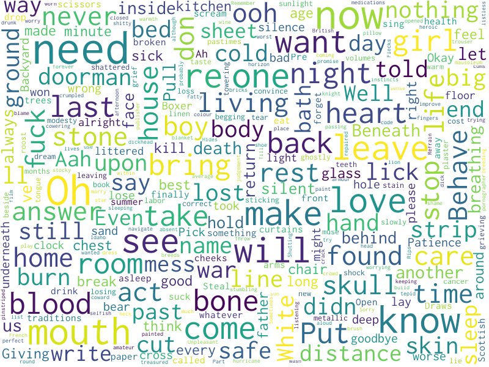

# thoughtbubble

A simple python CLI that creates a PNG wordcloud from a specified artist name. thoughtbubble queries the genius.com API. 

## installation

Installation is less than difficult. It works on macOS and Ubuntu Linux, not sure about anything else at the moment.

Clone the repository or download the zip and unpack it some where nice like your home directory

```bash
cd ~
git clone https://github.com/nqnzp/thoughtbubble

# or
wget https://github.com/nqnzp/thoughtbubble/archive/master.zip
unzip 
```

Make sure you have python installed, 2 or 3 should work.

For macOS, install [Homebrew](https://brew.sh), then install python

```bash
/usr/bin/ruby -e "$(curl -fsSL https://raw.githubusercontent.com/Homebrew/install/master/install)"

brew install python3
```

Create a virtualenv in somewhere nice, like your home directory

```bash

cd ~/thoughtbubble*

# Python 3
python3 -m venv venv/
. venv/bin/activate

# Python 2
virtualenv venv/
. venv/bin/activate


```

In your venv, run pip to install it

```bash
pip install --editable .
```

thoughtbubble requires an API token from Genius. Make an account for yourself
and generate a Client Access Token: https://genius.com/api-clients

Copy thoughtbubble.conf.example to thoughtbubble.conf

```bash
cp thoughtbubble.conf.example thoughtbubble.conf
```

Edit it to include your API token

```commandline
[thoughtbubble]
access_token = <your token>
```

And now you can run the dang thing

```bash
thoughtbubble "weezer"
```

Default output is a PNG file named thoughtbubble.png. You can also specify a different name for the output file
by evoking thoughtbubble with some arguments
```bash
thoughtbubble "Van Halen" hagar.png
```
CLI output isn't that fancy. Sometimes, genius.com has a hard time figuring out what
the name of the artist is you are searching for, so thoughtbubble returns a list of
all the artists genius thinks it might be and gives you a choice

```bash
thoughtbubble "spoon" mycamera.png
                             
     thoughtbubble 0.1.0 
                       

Searching genius.com for "spoon".

Genius.com is terrible at searching artist names.
Select an artist from the results it returned:
[1] BTS
[2] Macklemore & Ryan Lewis
[3] Поперечный (Poperechny)
[4] Lily Allen
[5] Spoon
[6] Elliphant
Enter a number[1-6]: 5
Generating a word cloud with lyrics from the top 20 songs by Spoon.
Scraping lyrics from genius.com
  [████████████████████████████████████]             
Making the wordcloud.
Word cloud written to mycamera.png.
```

## word clouds

Word clouds at the moment are non-configurable. Repeated words in songs are stripped out, as are song section
tags specified in genius like `[Chorus]` and `[Verse]` and `[Rad Solo]`.

For example, here is a wordcloud output called `frabbit.png`, which would be the result 
you run `thoughtbubble "Frightened Rabbit" frabbit.png`.



## acknowledgements

This project wouldn't have been possible without the hard work of other much smarter developers:

* [Click](https://github.com/pallets/click)
* [word_cloud](https://github.com/amueller/word_cloud)
