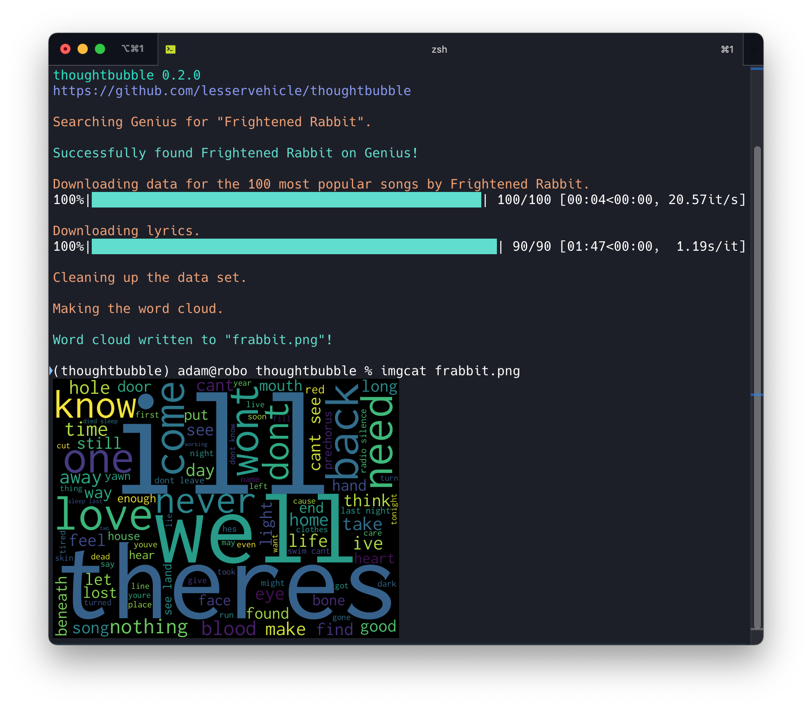

# thoughtbubble

A simple python CLI that creates a PNG wordcloud from a specified artist name. thoughtbubble queries the genius.com API.

## installation

Clone the repo somewhere nice and change to the new directory it just created.

```
git clone https://github.com/lesservehicle/thoughtbubble.git
cd thoughtbubble
```

Install pipenv if you don't have it already:

```bash
pip install pipenv
```

Use `pipenv` to install the package and create a new virtual environment:

```bash
pipenv install .
```

Use `pipenv shell` to open the virtual environment. 

```
% pipenv shell
Launching subshell in virtual environment...
 . /Users/adam/.local/share/virtualenvs/thoughtbubble-I9oEMh-u/bin/activate
adam@compy386 thoughtbubble %  . /Users/adam/.local/share/virtualenvs/thoughtbubble-
I9oEMh-u/bin/activate
```

Your prompt should change now to let you know you are in a virtualenv to something like this:

```bash
(thoughtbubble) adam@compy386:~/thoughtbubble$
```

Now in your activated virtualenv, run pip to install thoughtbubble with setuptools:

```bash
pip install -e .
```

A copy of the CLI will be made in your virtual environment and added to your  `$PATH`, so you'll be able to run it straight from where you are.

## configuration

thoughtbubble requires an API token from Genius. Make an account for yourself and generate a Client Access Token: [https://genius.com/api-clients](https://genius.com/api-clients)

Copy `thoughtbubble.conf.example` to `thoughtbubble.conf`

```bash
cp thoughtbubble.conf.example thoughtbubble.conf
```

Edit it to include your Access Token and set the query limit to whatever you like (default is 100).

```commandline
[thoughtbubble]
access_token = <your token>
limit = 100
```

And finally you can run the dang thing

```bash
thoughtbubble "weezer"
```

If you're on macOS, you can open the image you just created with Preview

```bash
open thoughtbubble.png
```

## usage

The default output is a PNG file named thoughtbubble.png. You can also specify a different name for the output file by evoking thoughtbubble with an extra argument.

```bash
thoughtbubble "Van Halen" nohagar.png
```

CLI output isn't that fancy. Sometimes, genius.com has a hard time figuring out what the name of the artist is you are searching for, so thoughtbubble will return a list of all the artists genius thinks it might be and gives you a choice:

```bash
(thoughtbubble) adam@compy386 thoughtbubble % thoughtbubble "spoon"
[nltk_data] Downloading package stopwords to /Users/adam/nltk_data...
[nltk_data]   Package stopwords is already up-to-date!
[nltk_data] Downloading package punkt to /Users/adam/nltk_data...
[nltk_data]   Package punkt is already up-to-date!

thoughtbubble 0.2.0
https://github.com/lesservehicle/thoughtbubble

Searching Genius for "spoon".

Genius is terrible at searching artist names!
Select an artist from the results it returned:
[1] Genius English Translations
[2] Soundgarden
[3] BTS
[4] The Lovin’ Spoonful
[5] Spoon
[6] Genius Romanizations
[7] Поперечный (Poperechny)
[8] Julie Andrews
[9] Elliphant
Enter a number [1-9]: 5

Downloading data for the 100 most popular songs by Spoon.
100%|██████████████████████████████████████████████████| 100/100 [00:07<00:00, 14.24it/s]

Downloading lyrics.
100%|████████████████████████████████████████████████████| 98/98 [01:42<00:00,  1.04s/it]

Cleaning up the data set.

Making the word cloud.

Word cloud written to "Spoon.png"!
```

## word clouds

Word clouds at the moment are non-configurable. Future versions will allow user configuration of the font size, dimensions, and background color of the word cloud.

Repeated words in songs are stripped out, as are song section tags specified in genius like `[Chorus]` and `[Verse]` and `[Guitar Solo]`. Words are normalized to lowercase, tokenized, and stopwords are removed.

For example, here is a wordcloud output called `frabbit.png`, which would be the result you run `thoughtbubble "Frightened Rabbit" frabbit.png`.



## acknowledgements

This project wouldn't have been possible without the hard work of other much smarter developers:

* [Click](https://github.com/pallets/click)
* [word_cloud](https://github.com/amueller/word_cloud)
* [https://bigishdata.com/2016/09/27/getting-song-lyrics-from-geniuss-api-scraping/](https://bigishdata.com/2016/09/27/getting-song-lyrics-from-geniuss-api-scraping/)
* [http://www.compjour.org/warmups/govt-text-releases/intro-to-bs4-lxml-parsing-wh-press-briefings/](http://www.compjour.org/warmups/govt-text-releases/intro-to-bs4-lxml-parsing-wh-press-briefings/)
